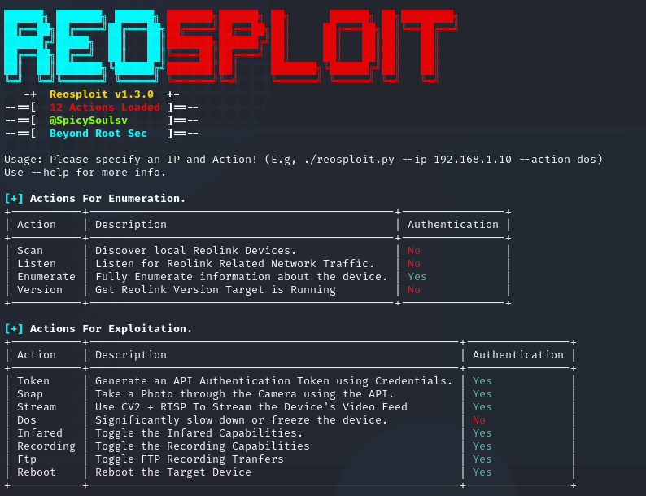

# 🕱📸🕱 ReoSploit - Version 1.3.0

### A Tool that Finds, Enumerates and Exploits Reolink Cameras.



[](https://forthebadge.com)
[](https://forthebadge.com)

### ☑️ Features

#### V 1.0.0

* Scanning Networks for Reolink Devices.
* Listening to Network Traffic for Reolink credentials and sessions.
* Generating API Tokens from Credentials.
* Enumerating the device for users, hardware information, firmware information, etc.
* Taking a Photo through the Camera and saving it.

#### V 1.1.0

* Streaming Live Video
* DOSing the Device's Video Feed & Web Page

#### V 1.2.0

* Toggling Infared Capabilities
* Toggling Recording Capabilities

#### V 1.3.0

* Detect Reolink Version Running
* Toggle FTP Capablities
* Force Device to Fully Reboot

### 🛠 Installation

```sh
git clone https://github.com/spicesouls/reosploit
cd reosploit && pip install -r requirements.txt
chmod +x reosploit.py
sudo ./reosploit.py -h
```

### 📃 Usage

```
sudo ./reosploit.py [-h] [-u U] [-p P] [-i I] [-t T] [--ip IP or IP CIDR ] [--action ACTION ]
```

### 📖 Examples

#### Finding Local Reosploit Cameras
`sudo ./reosploit.py 192.168.1.0/24 scan`
#### Listening to Reolink Network Traffic
`sudo ./reosploit.py 192.168.1.10 listen -i eth0`
#### Generating an API Token with Credentials
`sudo ./reosploit.py 192.168.1.10 token -u admin -p password`
#### Enumerating the Device
`sudo ./reosploit.py 192.168.1.10 enumerate -u admin -p password`
#### Getting a Photo From the Camera
`sudo ./reosploit.py 192.168.1.10 snap -u admin -p password`

**🚧! THIS IS FOR STRICTLY EDUCATIONAL PURPOSES, I AM NOT RESPONSIBLE FOR YOUR USE OF THIS !🚧**

[License](LICENSE)
